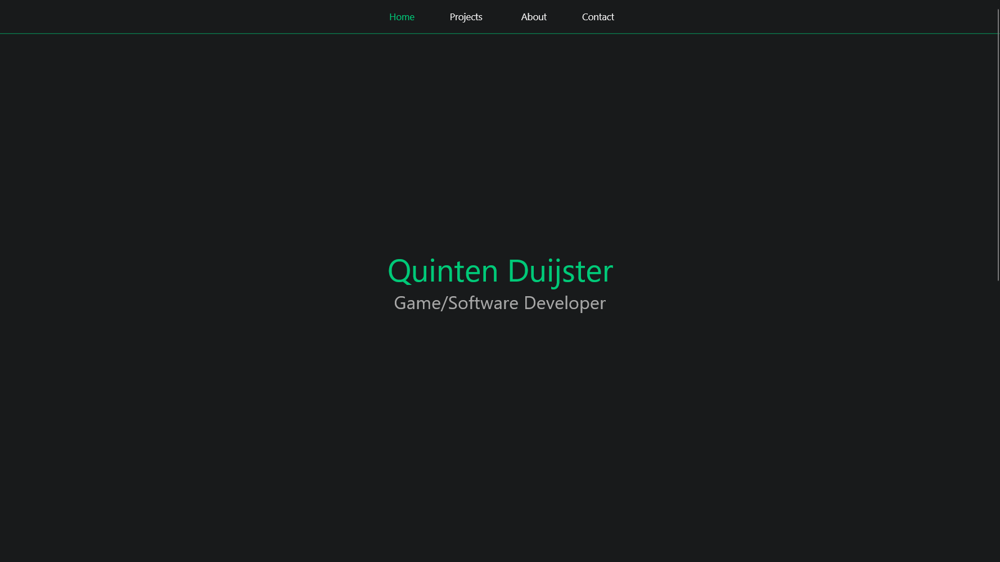
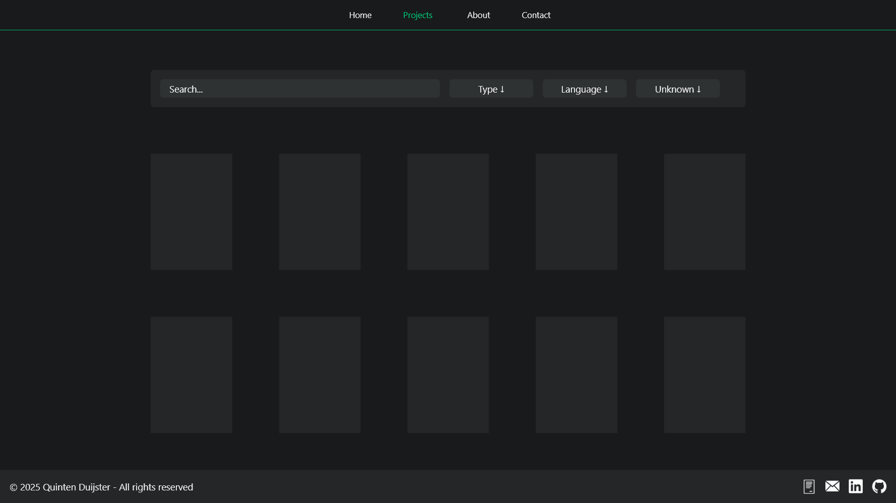
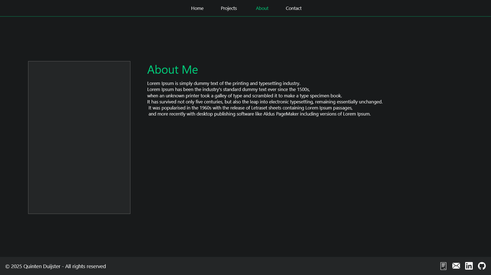

:::iframe http://localhost:5173/#/:::

## Description
I created this project because I wanted a way to showcase my work to companies for internships and job opportunities.

I built the website using React with TypeScript to highlight my skills in modern web development.
I chose React because I had experience with it previously, and it is widely used in the industry.

The goal of the project is to create a platform where I can display my projects, 
skills, and experience, giving visitors an idea of the kind of developer I am and the work I am capable of.
Additionally, the platform should be highly maintainable, allowing me to update content — such as adding new projects or modifying details without needing to dive into the code each time.

## Core Features
- Markdown to HTML parser makes it easy to write and update project pages without touching the main code
- Dynamic project automatically loads project content on a single page based on the URL
- Interactive UI components built with React and TypeScript for smooth, reusable components
- Easy project management adding or updating projects only requires editing Markdown files
- Showcase skills demonstrates both front-end development and project organization

## The Design
To plan the layout of my portfolio website, I started by using Adobe XD to create a general design for the pages I wanted to include.
This initial design served as a guideline during development, helping me maintain a consistent look and feel across the site.

Initial home page design:



Initial projects page design:



Initial about page design:



## Markdown to HTML Parser
To make writing and managing project pages easier, I created a script that converts Markdown files into HTML, which can then be dynamically loaded on the website.

To accomplish this, I used the following packages
- marked: for converting markdown to html
- gray-matter: extracts metadata from the top of project Markdown files
- highlight.js: provides syntax highlighting for code snippets

This system allows me to add or update projects quickly without touching the main website code, making the portfolio scalable and easy to maintain.

[view source code](https://github.com/Entropire/entropire.github.io/blob/master/scripts/build-content.js)

## Dynamic project loading
To display the generated HTML project files, I created a page that dynamically loads content based on the URL.

First, I retrieve the project name from the URL using React Router:
```typescript
const { projectName } = useParams<{ projectName: string }>();
```

Next, I fetch the corresponding HTML file:
```typescript
useEffect(() => {
    // Run this effect whenever `projectName` changes
    if (!projectName) return;

    fetch(`/projects/${projectName.toLowerCase()}.html`) 
        // Fetch the HTML file that matches the current project name
        .then((res) => {
            if (!res.ok) throw new Error("Not found");
            // Convert the response to text (HTML content)
            return res.text();
        })
        .then((content) => {
            // Store the HTML content in state
            setHtml(content);
        })
        .catch(() => {
            // If any error occurs (e.g., file not found), update the error state
            setError(true);
        });
}, [projectName]); // Re-run effect when `projectName` changes
```

Finally, I render the HTML inside the page:
```html
<div
    className={ProjectCSS.ProjectPage}
    dangerouslySetInnerHTML={{ __html: html }}
/>
```

Since I don’t have access to the classes or IDs inside the loaded HTML, 
I apply general CSS rules to HTML elements within the container using the class ProjectCSS.ProjectPage. 
This ensures the dynamically loaded content is styled consistently with the rest of the site.

## Reflection
Working on this project helped me gain a better understanding of website design and how to effectively use CSS for styling. 
I also learned how to set up a CI/CD pipeline to deploy a static website to GitHub Pages, 
which improved my workflow and deployment skills.

In the next stage of this project, I plan to refactor and improve the codebase and make the website fully responsive, 
so it works seamlessly on desktop, tablet, and mobile devices.