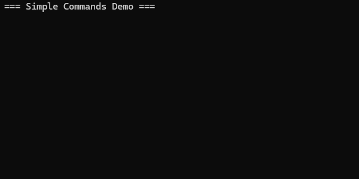

## Description
I created this project because I found myself rewriting a command interface in multiple c# projects.
So to stop myself from reinventing the wheel and to save time, I decided to build a reusable command system that I could use in all my project where I needed it.
The goal of this project was to create a lightweight, easy-to-use library that provides a flexible way to define, register and trigger commands.

## Core Features
- Define commands with ease
- Register and deregister commands dynamically
- Switch between command handlers effortlessly
- Trigger commands based on user input

## Command Definition
You can create and register a command dynamically either using a class or a lambda expression.
```cs
[CommandName("eco")]
// Sets the command name for this class
internal class EcoCommand : Command
{
    // Function executed when the command is run
    public override void Execute(string commandName, string[] args)
    {
        // Ensure there is at least one argument
        if (args.Length == 0) return;

        Console.WriteLine(args[0]);
    }
}

public class Program
{
    // Initialize a command handler with "/" as the command prefix
    private readonly CommandHandler _handler = new("/");

    public static void Start() => new Program().Run();

    public void Run()
    {
        // Registering a command via a class
        _handler.RegisterCommand(new EcoCommand());
        
        // Registering a command via a lambda expression
        _handler.RegisterCommand("hello", (commandName, args) =>
        {
            // Ensure there is at least one argument
            if (args.Length == 0) return;
            
            Console.WriteLine($"Hello {args[0]}");
        });
    }
}
```

## Command Storage
Commands are stored in a dictionary that maps each command name to its corresponding execution delegate.
This allows for fast, case-insensitive lookups and ensures that each command name is unique within the registry.
```cs
private Dictionary<string, Action<string, string[]>> dictionaryOfCommands = new(StringComparer.OrdinalIgnoreCase);
```
- Key (string): The command name (e.g., "hello", "eco").
- Value (Action<string, string[]>): A reference to the command’s execution logic.
- Case-insensitive lookup: Using StringComparer.OrdinalIgnoreCase allows users to invoke commands regardless of letter casing (e.g., "HELLO" and "hello" are treated the same).
- Uniqueness enforced: Attempting to register a command with an existing name throws an InvalidOperationException.

## Command Calling
Commands can be executed by simply passing a user input string to the handler:
```cs
string userInput = "/eco helloworld"
_handler.Execute(userInput);
``` 
Internally, the input string is automatically split into the command name and its arguments.
The corresponding command is then executed.
```cs
public bool TryParseUserInput(string userInput, out string commandName, out string[] commandArgs)
{
    commandName = string.Empty;
    commandArgs = Array.Empty<string>();

    // Validate input and ensure it starts with the defined prefix
    if (string.IsNullOrWhiteSpace(userInput) || !userInput.StartsWith(CommandPrefix))
        return false;

    // Split the input into parts
    string[] parts = userInput.Split(' ', StringSplitOptions.RemoveEmptyEntries);

    // Extract command name (without prefix)
    commandName = parts[0].Substring(CommandPrefix.Length);

    // Extract command arguments
    commandArgs = parts.Skip(1).ToArray();
    return true;
}
```

For example, the input ```"/eco helloworld"``` would be parsed into:
- Command Name: ```"eco"```
- Arguments: ```"["helloworld"]"``` 

This approach simplifies user input handling, removes the need for manual string parsing, and ensures consistent command parsing across your application.

## Reflection
Working on SimpleCommands helped me think carefully about modular and reusable library design.
I learned how to create a flexible API that supports both class-based and inline commands, and how to handle user input consistently with minimal boilerplate.

If I were to continue developing this library, I’d like to add async command support, 
improve error handling and logging, 
and explore ways to extend the command parser for more complex input patterns.